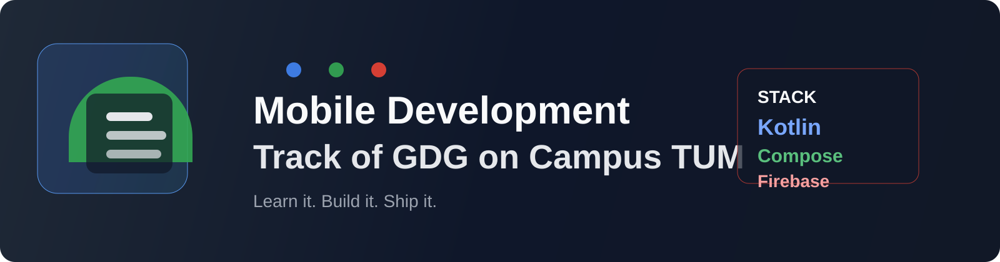
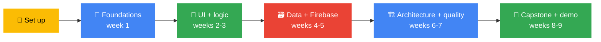

<div align="center">



<br/>


[🔭 Vision](vision/README.md) · [🚀 Getting Started](GETTING-STARTED.md) · [📅 Weekly Sessions](weekly-sessions/README.md) · [🧭 Learning Path](learning-path/README.md) · [🛠️ Projects](projects/README.md) · [📚 Docs](docs/README.md) · [👥 Members](members/README.md)

</div>

---

## ✨ Why this track exists

Mobile apps are no longer a niche skill. They are a practical way to build products, solve real user problems, and create a visible portfolio that employers and communities can evaluate.

This track exists to help students move from “I use apps” to “I can build them.” We learn by shipping small, useful products with modern Android tools, clean architecture, and community support.

We teach the way real teams work: version control, project structure, debugging, simple testing, and product thinking. The goal is not only to write code, but to build confidence and deliver something that works.

🔭 **Want to see the broader direction?** Read [the vision](vision/README.md).

| 📱 Understand | 🔨 Build | 🤝 Ship with confidence |
|---|---|---|
| Learn how Android apps are structured and why the tools work the way they do. | Create real app features, screens, and flows using Kotlin and Jetpack Compose. | Present a working mobile project, explain decisions, and keep improving. |

**No mobile development experience is needed.** If you can use a laptop, install software, and stay curious, you belong here.

> [!TIP]
> **Lost in this repo?** Start with [GETTING-STARTED.md](GETTING-STARTED.md), then follow the [weekly sessions](weekly-sessions/README.md).

---

## 🧭 Start here: how to use this repo

### If you are new, follow these 5 steps

| Step | Do this | Where |
|:-:|---|---|
| **1** | Read this page so you know what the track is | You are here |
| **2** | Set up Android Studio, Git and the tools | [GETTING-STARTED.md](GETTING-STARTED.md) |
| **3** | Make your first contribution by adding your profile | [members/](members/README.md) |
| **4** | Open Week 1 and follow the session plan | [weekly-sessions/](weekly-sessions/README.md) |
| **5** | Share your plan and build a capstone app | [member-roadmaps](https://github.com/GDG-TUM/member-roadmaps) |

### Or jump straight to what you need

| I want to... | Go here |
|--------------|---------|
| **Understand what this track is about** | [The vision](vision/README.md) |
| **Set up Android Studio and tools** | [Getting Started](GETTING-STARTED.md) |
| **See the weekly plan** | [Weekly Sessions](weekly-sessions/README.md) |
| **Follow the full learning path** | [Learning Path](learning-path/README.md) |
| **See the plan, week by week** | [Roadmap](roadmap/semester-roadmap.md) |
| **Start or join a project** | [Projects](projects/README.md) |
| **Find free resources and cheat sheets** | [Resources](resources/README.md) |
| **Understand the track workflow** | [Docs](docs/README.md) |
| **Ask a question** | [Open an issue](https://github.com/GDG-TUM/Mobile-Development-Track-GDG-on-Campus-TUM/issues/new/choose) |

### Your journey through the track



---

<a id="goals"></a>

## 🎯 Track goals for the 2026/27 academic year

By the end of this semester, every active member should be able to:

1. Explain the Android app stack and how a mobile app is built
2. Write Kotlin code confidently and use Jetpack Compose for UI
3. Build a multi-screen app with proper state and navigation
4. Work with local data and cloud-backed features using Firebase
5. Apply good architecture and testing practices
6. Build and present a small but real mobile app project
7. Have at least one public project on GitHub to show employers and peers

---

<a id="learning-path"></a>

## 🧭 Learning path

Six stages that move from beginner-friendly foundations to shipping a complete app. [See the full learning path →](learning-path/README.md)

| Stage | Topics | Outcome | Read |
|-------|--------|---------|------|
| **1. Foundations** | Android basics, Kotlin, Android Studio | You can run and understand a basic app | [Stage 1](learning-path/01-foundations.md) |
| **2. UI and layouts** | Compose, Material 3, state, layout systems | You can build clean interfaces | [Stage 2](learning-path/02-ui-and-layouts.md) |
| **3. App logic** | Navigation, ViewModel, screen flow, events | You can build a multi-screen app | [Stage 3](learning-path/03-app-logic.md) |
| **4. Data and persistence** | Room, SharedPreferences, networking, JSON | You can manage app data | [Stage 4](learning-path/04-data-and-persistence.md) |
| **5. Firebase** | Auth, Firestore, storage, realtime features | You can build connected apps | [Stage 5](learning-path/05-firebase.md) |
| **6. Ship it** | Architecture, testing, polish, presentation | You can explain and deliver a project | [Stage 6](learning-path/06-ship-it.md) |

---

<a id="roadmap"></a>

## 🗓️ 9-week roadmap

Click a week to open the workshop direction and challenge. [Full schedule →](weekly-sessions/README.md)

| Week | Focus | What we do |
|:-:|---|---|
| **[1](weekly-sessions/week-01-android-foundations/README.md)** | Android foundations | Android architecture, Kotlin basics, setup |
| **[2](weekly-sessions/week-02-ui-and-compose/README.md)** | UI design | Compose layouts, Material Design, simple screens |
| **[3](weekly-sessions/week-03-app-logic-and-navigation/README.md)** | App logic and navigation | State, ViewModel, navigation, data passing |
| **[4](weekly-sessions/week-04-data-and-persistence/README.md)** | Data handling | Local storage, networking, JSON, Room basics |
| **[5](weekly-sessions/week-05-firebase/README.md)** | Firebase | Auth, Firestore, cloud data, real-time features |
| **[6](weekly-sessions/week-06-architecture-and-quality/README.md)** | Architecture and quality | MVVM, repositories, testing fundamentals |
| **[7](weekly-sessions/week-07-advanced-features/README.md)** | Advanced mobile features | Notifications, maps, accessibility, performance |
| **[8](weekly-sessions/week-08-capstone-sprint/README.md)** | Capstone sprint | Product planning, feature build, prototype refinement |
| **[9](weekly-sessions/week-09-launch-and-reflection/README.md)** | Launch and reflection | Final polish, demo, retrospective |

---

<a id="typical-week"></a>

## 🛠️ How a typical week works

- **One session per week** (hands-on, usually around 90 minutes)
- **A short concept intro**, followed by live coding and debugging
- **A small challenge** to reinforce the session material
- **Notes and code pushed to the repo** after the session
- **A help channel** for questions and peer support

**Missed a session?** Open that week's folder in [weekly-sessions/](weekly-sessions/README.md) and continue from there.

---

<a id="projects"></a>

## 🚀 Projects

The capstone is the main project outcome of the track. Members build something useful, understandable and shareable.

Ideas include:

- Campus marketplace app
- Study planner and reminder app
- Fitness tracker or habit tracker
- Event app for GDG chapters
- Local resource finder for students
- Community board app

| | |
|---|---|
| 📖 [Project guide](projects/README.md) | How to start, scope and deliver a good app project |
| 💡 [Project ideas](projects/README.md) | Good beginner, intermediate and advanced directions |
| 🧱 [Starter app](weekly-sessions/week-01-android-foundations/README.md) | Use the first weeks as a launching point |
| 🌟 [Showcase](projects/README.md) | Share finished work with the chapter |
| 🚀 [Propose a project](https://github.com/GDG-TUM/Mobile-Development-Track-GDG-on-Campus-TUM/issues/new/choose) | Open a project proposal issue |

---

<a id="roles"></a>

## 👥 Roles in the track

| Role | Responsibility |
|------|---------------|
| **Track lead** | Plans the semester, runs sessions, keeps the repo useful |
| **Maintainers** | Review contributions and help members move forward |
| **Mentors (invited)** | Help teams with debugging, product thinking and demos |
| **Members** | Attend, complete challenges, build projects, help each other |

---

<a id="involved"></a>

## ✅ How to get involved

1. Make sure you have joined the [**GDG-TUM** GitHub organization](https://github.com/GDG-TUM)
2. Add your plan in the [**member-roadmaps**](https://github.com/GDG-TUM/member-roadmaps) repo
3. Set up Android Studio and the required tools in [GETTING-STARTED.md](GETTING-STARTED.md)
4. Start with Week 1 and follow the roadmap in order
5. Open a pull request when you add notes, resources or improvements

**New to GitHub?** That is fine. Keep changes small and readable, and ask in the track channel.

---

<a id="resources"></a>

## 📚 Free resources to start with

- [Android Developers Documentation](https://developer.android.com/docs)
- [Kotlin Docs](https://kotlinlang.org/docs/home.html)
- [Jetpack Compose documentation](https://developer.android.com/jetpack/compose)
- [Firebase documentation](https://firebase.google.com/docs)
- [GitHub Skills](https://skills.github.com)

**More inside this repo:**
[All resources](resources/README.md) · [Projects](projects/README.md) · [Contributing](CONTRIBUTING.md)

---

<a id="success"></a>

## 📈 How we will know the track is working

- Members complete at least one app prototype
- Team projects are shown at demo day
- Members publish GitHub repos and pull requests
- Members improve from beginner to capable builders
- Feedback after each session helps future cohorts

Tell us how we are doing: [give feedback](https://github.com/GDG-TUM/Mobile-Development-Track-GDG-on-Campus-TUM/issues/new/choose).

---

<a id="good-to-know"></a>

## ⚠️ Good to know

> [!WARNING]
> **Keep API keys and secrets out of the repo.** Never commit Firebase config values or personal tokens.

- **Build small, testable features early.** Mobile projects grow fast.
- **Be kind.** We follow the [Code of Conduct](CODE_OF_CONDUCT.md).
- **Use device emulators and physical devices** to test real behavior.
- **Cannot attend a session?** Everything is in this repo. Work through the week and ask for help.

---

## 🗂️ Repo map

```text
Mobile-Development-Track-GDG-on-Campus-TUM/
├── README.md                          ← you are here
├── GETTING-STARTED.md                 ← setup checklist
├── CONTRIBUTING.md                    ← how to contribute
├── CODE_OF_CONDUCT.md                 ← community expectations
├── LICENSE.md                         ← MIT license
├── weekly-sessions/                   ← one folder per week
├── learning-path/                     ← 6 stages from basics to shipping
├── projects/                          ← project guide and ideas
├── resources/                         ← docs, cheat sheets, references
├── members/                           ← add your profile and plans
├── docs/                              ← workflow and track process docs
├── vision/                            ← what mobile development can do
├── roadmap/                           ← semester planning
├── assets/                            ← banner and visual assets
├── .github/                           ← issue templates and workflows
├── MOBILE_TRACK_9_WEEK_CALENDAR.md    ← 9-week schedule
└── ...
```

**Folder links:** [weekly-sessions](weekly-sessions/README.md) · [learning-path](learning-path/README.md) · [projects](projects/README.md) · [resources](resources/README.md) · [members](members/README.md) · [docs](docs/README.md)

---

## 📬 Contact

| | |
|---|---|
| 🏠 **GitHub organization** | [github.com/GDG-TUM](https://github.com/GDG-TUM) |
| 📋 **Chapter project board** | [GDG-TUM Projects](https://github.com/orgs/GDG-TUM/projects/1) |
| ☁️ **Cloud Track** | [Cloud Track](https://github.com/GDG-TUM/Cloud-Track-GDG-on-Campus-TUM) |
| 🤖 **AI/ML Track** | [AI/ML Track](https://github.com/GDG-TUM/AI-ML-Track-GDG-on-Campus-TUM) |
| ✉️ **Email** | [gdgtum@gmail.com](mailto:gdgtum@gmail.com) |
| 💬 **Questions about this track** | [Open an issue](https://github.com/GDG-TUM/Mobile-Development-Track-GDG-on-Campus-TUM/issues/new/choose) |

📄 Licensed under the [MIT License](LICENSE.md).

<div align="center">

<a href="#">⬆️ Back to top</a>

*Learn. Build. Ship. Together.* 📱

</div>

---

## Recommended tools

- Android Studio
- Kotlin
- Jetpack Compose
- Firebase Console
- Git and GitHub
- Postman
- Figma (optional)

---

## Suggested outcomes

By the end of this track, members should be able to:

- Build simple Android apps with modern UI patterns
- Work with local and remote data
- Connect apps to Firebase services
- Apply architecture and testing principles
- Present a complete mobile app project
- Contribute meaningfully to mobile product work in the chapter

This repository is intended to grow with the chapter. If you are part of GDG on Campus, feel free to add resources, workshop notes, assignments and project examples.

---

## Contribution

This repository is meant to evolve with the community. If you are part of GDG on Campus, please feel free to contribute resources, workshop notes, assignments and project examples.

Please review [CONTRIBUTING.md](CONTRIBUTING.md) before submitting changes.

---

## License

This project is licensed under the [MIT License](LICENSE.md).
