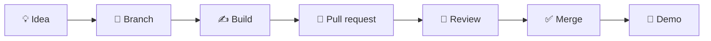

# Mobile Development Track - GDG on Campus TUM

<div align="center">


<br/>


[🔭 Overview](#overview) · [🚀 Getting Started](GETTING-STARTED.md) · [📅 Weekly Plan](MOBILE_TRACK_9_WEEK_CALENDAR.md) · [🧭 Learning Path](#learning-path) · [🛠️ Projects](#projects) · [🤝 Contributing](CONTRIBUTING.md)

</div>

---

## Why this track exists

Mobile development is one of the fastest ways to turn ideas into user-facing products. This track gives students a structured path from first app concepts to a working Android project built with modern tools and real-world workflows.

We focus on practical learning: writing code, building UIs, handling data, integrating Firebase, and shipping an app that can be presented to peers and future employers.

This repository is designed to help members move from "I am curious about mobile development" to "I can build and present an Android app with confidence."

| 🧠 Learn | 🔨 Build | 🚀 Ship |
|---|---|---|
| Understand how mobile apps work, how Android apps are structured, and why good architecture matters. | Create real apps with Kotlin, Jetpack Compose, Firebase, navigation, persistence, and testing. | Finish with a capstone project, a working demo, and a clearer path into Android or full-stack mobile product work. |

**No prior Android experience is required.** If you are new to mobile, start with the beginner-friendly setup guide and work through the first weeks in order.

> [!TIP]
> This repo is the home for the Mobile Development Track. Use it as the main entry point for setup, sessions, projects, and milestones.

---

## Overview

This track focuses on:

- Mobile app fundamentals and modern Android development
- Kotlin and Jetpack Compose
- Firebase and cloud-backed app features
- State management, navigation, and architecture
- Testing, deployment, and app presentation
- Capstone project planning and demo delivery

---

## Start here: how to use this repo

### If you are new, follow these 5 steps

| Step | Do this | Where |
|:-:|---|---|
| **1** | Read this page so you know the structure and goals | You are here |
| **2** | Set up your laptop and Android tools | [GETTING-STARTED.md](GETTING-STARTED.md) |
| **3** | Open the 9-week roadmap and plan your milestones | [MOBILE_TRACK_9_WEEK_CALENDAR.md](MOBILE_TRACK_9_WEEK_CALENDAR.md) |
| **4** | Start Week 1 and follow the learning path | [#learning-path](#learning-path) |
| **5** | Share your plan and build a project | [member-roadmaps](https://github.com/GDG-TUM/member-roadmaps) |

### Or jump straight to what you need

| I want to... | Go here |
|--------------|---------|
| **Set up Android Studio and tools** | [Getting Started](GETTING-STARTED.md) |
| **See the weekly plan** | [9-Week Calendar](MOBILE_TRACK_9_WEEK_CALENDAR.md) |
| **Follow the learning sequence** | [Learning Path](#learning-path) |
| **Find project ideas** | [Projects](#projects) |
| **Learn how to contribute** | [Contributing](CONTRIBUTING.md) |
| **Understand the repo workflow** | [How we work](#how-we-work) |
| **Ask a question** | [Open an issue](https://github.com/GDG-TUM/Mobile-Development-Track-GDG-on-Campus-TUM/issues/new/choose) |

---

## Learning path

The track is structured to move from fundamentals to a real app project.

| Stage | Topics | Outcome | Deliverable |
|-------|--------|---------|-------------|
| **1. Foundations** | Android ecosystem, Kotlin basics, Android Studio setup | You can run a project and understand the mobile stack | Hello World + basic app |
| **2. UI and Layouts** | Compose, Material 3, state, layout systems | You can build clean interfaces | Form or UI app |
| **3. App Logic and Navigation** | State, ViewModel, nav graphs, screens | You can move between screens and pass data | Multi-screen app |
| **4. Data and Persistence** | Room, SharedPreferences, networking, JSON | You can handle app data and APIs | Data-driven app |
| **5. Firebase & Backend** | Auth, Firestore, storage, real-time features | You can build connected apps | User-based or collaborative app |
| **6. Architecture & Quality** | MVVM, repository pattern, testing, DI basics | You can build more maintainable apps | Tested app architecture |
| **7. Advanced Features** | Notifications, media, maps, accessibility, performance | You can add production-grade features | Feature-rich prototype |
| **8. Capstone Sprint** | Product idea, data model, build, test, refine | You have a complete app prototype | Working capstone |
| **9. Launch & Reflection** | Polish, publish workflow, presentation, next steps | You can present and explain your work | Final demo + reflection |

---

## 9-week roadmap

| Week | Focus | What we do |
|:-:|---|---|
| **1** | Mobile foundations | Android architecture, Kotlin basics, Android Studio setup |
| **2** | UI design | Compose layouts, Material Design, simple screens |
| **3** | App logic and navigation | State, ViewModel, navigation, data passing |
| **4** | Data handling | Local storage, networking, JSON, Room basics |
| **5** | Firebase | Auth, Firestore, cloud data, real-time features |
| **6** | Architecture and quality | MVVM, repository patterns, testing fundamentals |
| **7** | Advanced mobile features | Notifications, media, maps, accessibility, performance |
| **8** | Capstone sprint | Product planning, feature build, prototype refinement |
| **9** | Launch and reflection | Final polish, app demo, presentation, next steps |

---

## How a typical week works

- One session per week focused on building together
- A short concept introduction, then a hands-on coding task
- A practical weekly challenge or mini-app assignment
- Time to test, debug, and reflect on what worked
- Notes and code pushed to this repo for later reference
- A community space for questions and peer learning

**Missed a session?** Work through the week in the roadmap and continue with the next concept. Mobile development is cumulative, so it is best to keep up consistently.

---

## Projects

The capstone is the main project outcome of this track. Members are encouraged to build something useful, understandable, and shareable.

### Suggested project ideas

- Event app for GDG chapters
- Campus marketplace app
- Study planner
- Fitness tracker
- Food ordering prototype
- Community board app
- Campus resource finder
- Local event attendance tracker

| | |
|---|---|
| 📖 [Project guide](#projects) | Start with a clear problem, user, and feature set |
| 💡 [Ideas](#projects) | Choose a project that is useful and achievable |
| 🧱 [Starter app](MOBILE_TRACK_9_WEEK_CALENDAR.md) | Use the weekly plan as a starting template |
| 🌟 [Showcase](#projects) | Share finished work with the chapter |
| 🚀 [Propose a project](https://github.com/GDG-TUM/Mobile-Development-Track-GDG-on-Campus-TUM/issues/new/choose) | Open a project proposal issue |

---

## How we work

We run this track like a small, collaborative learning project. The point is not only to learn tools, but to learn how to build well in a team and communicate clearly.



| Practice | What it means here |
|---|---|
| **Issue-first work** | Start with a clear task or problem statement |
| **Short branches** | Keep work focused and easy to review |
| **Pull requests** | Share progress and ask for feedback |
| **Code reviews** | Learn from peers and improve quality |
| **Documentation** | Keep readme and notes clear for future members |
| **Demo mindset** | Every project should be explainable and presentable |

---

## Get involved

1. Make sure you have joined the [GDG-TUM GitHub organization](https://github.com/GDG-TUM)
2. Add your personal learning plan in the [member-roadmaps](https://github.com/GDG-TUM/member-roadmaps) repo
3. Set up Android Studio and the required tools from [GETTING-STARTED.md](GETTING-STARTED.md)
4. Start with Week 1 and work through the roadmap in order
5. Open a pull request when you add notes, resources, or project improvements

**New to GitHub?** No problem. Start by reading the setup guide and keep your changes small and clear.

---

## Repo map

```text
Mobile-Development-Track-GDG-on-Campus-TUM/
├── README.md                           ← you are here
├── GETTING-STARTED.md                  ← setup checklist
├── MOBILE_TRACK_9_WEEK_CALENDAR.md     ← 9-week schedule
├── CONTRIBUTING.md                     ← how to contribute
├── CODE_OF_CONDUCT.md                 ← community expectations
├── LICENSE.md                         ← MIT license
├── docs/                              ← design notes and process docs
├── assets/                            ← banners and visual assets
├── .github/                           ← issue templates and workflows
└── member-roadmaps                    ← planning repository for track members
```

---

## Contact

| | |
|---|---|
| 🏠 **GitHub organization** | [github.com/GDG-TUM](https://github.com/GDG-TUM) |
| 📋 **Chapter project board** | [GDG-TUM Projects](https://github.com/orgs/GDG-TUM/projects/1) |
| ☁️ **Sister track** | [Cloud Track](https://github.com/GDG-TUM/Cloud-Track-GDG-on-Campus-TUM) |
| 🤖 **AI/ML Track** | [AI/ML Track](https://github.com/GDG-TUM/AI-ML-Track-GDG-on-Campus-TUM) |
| ✉️ **Email** | [gdgtum@gmail.com](mailto:gdgtum@gmail.com) |
| 💬 **Questions about this track** | [Open an issue](https://github.com/GDG-TUM/Mobile-Development-Track-GDG-on-Campus-TUM/issues/new/choose) |

📄 Licensed under the [MIT License](LICENSE.md).

<div align="center">

<a href="#">⬆️ Back to top</a>

*Learn. Build. Ship. Together.* 📱

</div>

---

## Recommended tools

- Android Studio
- Kotlin
- Jetpack Compose
- Firebase Console
- Git and GitHub
- Postman
- Figma (optional)

---

## Track outcomes

By the end of this program, participants should be able to:

- Build simple Android apps with modern UI patterns
- Work with local and remote data
- Connect apps to Firebase services
- Apply architecture and testing principles
- Present a complete mobile app project
- Contribute as a future mobile lead in a tech community

This repo is intended to grow with the chapter. If you are part of GDG on Campus, feel free to add resources, workshop notes, assignments, and project examples.

---

## Contribution

This repository is meant to evolve with the community. If you are part of GDG on Campus, please feel free to contribute resources, workshop notes, assignments, and project examples.

Please review [CONTRIBUTING.md](CONTRIBUTING.md) before submitting changes.

---

## License

This project is licensed under the [MIT License](LICENSE.md).

